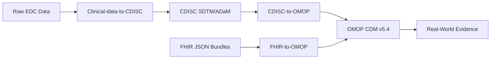

<h1 align="center">
  Hi there, I'm Mário Costa 👋
</h1>

<h3 align="center">
  Biochemist | Clinical Data Engineer | Statistical Programmer
</h3>

  Python • SAS • SQL | CDISC SDTM/ADaM • FHIR • OMOP CDM

  
  

---

I am a **biochemist specializing in Clinical Data Engineering and Statistical
Programming**. I build reproducible and auditable pipelines across **CDISC,
FHIR, and OMOP CDM**, combining biomedical domain knowledge with Python, SAS,
SQL, data quality controls, and clinical terminology governance.

My portfolio follows clinical data from synthetic raw EDC or FHIR inputs to
analysis- and RWE-oriented structures. It emphasizes traceability, deterministic
processing, explicit validation boundaries, and human-reviewed semantic mapping.
The projects are portfolio/reference implementations and do not claim regulatory
validation or clinical production use.

I am seeking junior opportunities in **CROs, pharmaceutical companies, RWE, and
healthcare IT**, in Portugal, across Europe, or remotely.

### 🛠️ Tech Stack & Skills

- **Languages:** Python, SAS, SQL
- **Data Engineering:** DuckDB, Pandas, ETL Pipelines, RAG (Retrieval-Augmented Generation)
- **Clinical Standards:** OMOP CDM v5.4, CDISC (SDTM/ADaM), FHIR, OHDSI Ecosystem
- **AI & ML:** Ollama, ChromaDB, Sentence-Transformers
- **Software Engineering:** Flask, PostgreSQL, Pytest, Git, GitHub Actions, CI/CD, Ruff, Data Governance

---

### 🚀 Featured Clinical Data Projects

My portfolio forms a coherent narrative covering the entire clinical data lifecycle, from Raw Electronic Data Capture (EDC) to Real-World Evidence (RWE) ready formats:

#### 1. [FHIR-to-OMOP](https://github.com/MrCosta77/FHIR-to-OMOP) *(Python, DuckDB, AI)*
A production-oriented reference framework that transforms synthetic FHIR JSON
bundles into OMOP CDM v5.4.
- Combines deterministic terminology mapping with **RAG and local LLM proposals**.
- Implements fail-closed controls, blinded human review, provenance, and DQD checks.
- Includes CI, an extensive automated test suite, versioned benchmarks, and a reproducible release process.

#### 2. [CDISC-to-OMOP](https://github.com/MrCosta77/CDISC-to-OMOP) *(Python)*
A clinical data integration reference pipeline with production-oriented controls.
- Maps synthetic CDISC SDTM datasets into OMOP CDM v5.4 with record-level lineage.
- Uses deterministic and LLM-assisted terminology proposals behind a human approval gate.

#### 3. [Clinical-data-to-CDISC](https://github.com/MrCosta77/Clinical-data-to-CDISC) *(SAS, Python)*
An educational clinical programming pipeline built with synthetic study data.
- Transforms raw EDC-style inputs into CDISC-inspired SDTM and ADaM datasets.
- Demonstrates defensive SAS programming, QC, TLFs, and a structural Define-XML prototype without claiming submission readiness.

---

### 📊 The Pipeline Vision

---

### 💰 Beyond Clinical Data

Financial literacy is a personal interest of mine. As a complementary full-stack
project, I built [**Amealha**](https://amealha.pt), a personal finance platform
for tracking income and expenses, managing accounts, sharing household costs,
and exploring financial scenarios. It demonstrates my broader software
engineering practice across Flask, PostgreSQL, authentication, privacy, automated
testing, deployment, and production monitoring.

---

  <i>Open to Junior Clinical Data Engineer, Statistical Programmer, Clinical Data Programmer, and RWE opportunities.</i>

