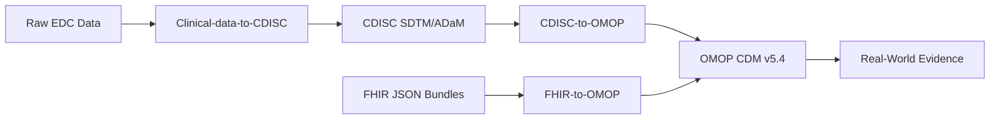

<h1 align="center">
  Hi there, I'm Mário Costa 👋
</h1>

<h3 align="center">
  Data Engineer & Statistical Programmer | Specializing in Clinical Data (OMOP, CDISC, FHIR)
</h3>

  
  

---

I am a passionate **Data Engineer / Statistical Programmer** looking to make an impact in the Healthcare and Clinical Research Organization (CRO) sectors. My focus is on transforming raw healthcare data into actionable insights through robust, compliant, and scalable pipelines.

I specialize in mapping and normalizing clinical data across industry standards like **FHIR, OMOP CDM, and CDISC**, leveraging modern tools like **Python, SAS, DuckDB, and Local LLMs (RAG)** to automate complex semantic mappings while maintaining strict governance and «Human-in-the-Loop» safety protocols.

### 🛠️ Tech Stack & Skills

- **Languages:** Python, SAS, SQL
- **Data Engineering:** DuckDB, Pandas, ETL Pipelines, RAG (Retrieval-Augmented Generation)
- **Clinical Standards:** OMOP CDM v5.4, CDISC (SDTM/ADaM), FHIR, OHDSI Ecosystem
- **AI & ML:** Ollama, ChromaDB, Sentence-Transformers
- **Software Engineering:** Pytest, Git, GitHub Actions, CI/CD, Ruff, Data Governance

---

### 🚀 Featured Clinical Data Projects

My portfolio forms a coherent narrative covering the entire clinical data lifecycle, from Raw Electronic Data Capture (EDC) to Real-World Evidence (RWE) ready formats:

#### 1. [FHIR-to-OMOP](https://github.com/MrCosta77/FHIR-to-OMOP) *(Python, DuckDB, AI)*
An enterprise-grade mapping framework that transforms FHIR JSON bundles into OMOP CDM v5.4. 
- Features a sophisticated **RAG engine** for semantic mapping using local LLMs.
- Implements strict **Data Governance**, Blinded Review Queues, and «Fail-Closed» defaults.
- End-to-end pipeline tested with 200+ integration and data quality tests.

#### 2. [CDISC-to-OMOP](https://github.com/MrCosta77/CDISC-to-OMOP) *(Python)*
A data integration pipeline standardizing clinical trial data.
- Maps CDISC SDTM datasets into the OMOP Common Data Model.
- Leverages LLM-assisted mapping for complex medical terminologies.

#### 3. [Clinical-data-to-CDISC](https://github.com/MrCosta77/Clinical-data-to-CDISC) *(SAS, Python)*
The foundation of clinical reporting.
- Transforms Raw EDC data into CDISC compliant SDTM and ADaM datasets.
- Utilizes both SAS and Python to ensure regulatory compliance and submission readiness.

---

### 📊 The Pipeline Vision

---

  <i>Seeking opportunities as a Junior Clinical Data Engineer / Statistical Programmer. Open to collaborations!</i>

